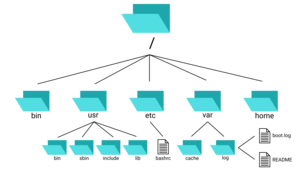
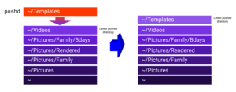
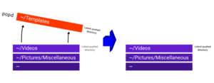
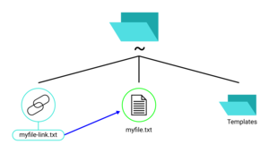
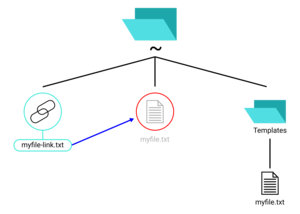
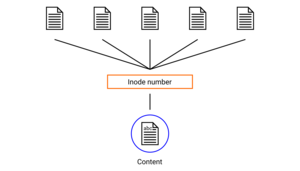

<h1 align="center">Credits</h1>

    This document contains names of people who have contributed to the guide,
    and the licenses used for the guide's contents.

<!-- Link aliases -->
[aut1]: https://github.com/NOVAglow

Text Credits
------------

The following table shows authors and contributors who have made changes to the
text content of the guide, by parts of the guide.

> **Note**: "Author" is the person who created the document and wrote some text
to it. "Contributors" are people who edited the text (excluding the author).

||Author|Contributors|
|:---:|:---:|---|
|**Preamble**|Nguyen Hoang Duong ([@NOVAglow][aut1])||
|**Chapter 1**|Nguyen Hoang Duong ([@NOVAglow][aut1])||
|**Chapter 2**|Nguyen Hoang Duong ([@NOVAglow][aut1])||
|**Chapter 3**|Nguyen Hoang Duong ([@NOVAglow][aut1])||

Image Credits
-------------

This table shows the author and the license of each image. The images are sorted
according to order of appearance in the guide.

<!-- This table was generated using script/mkimgcreds.new.py -->
<!--
    EDIT:

    1) Replace full link "https://github.com/NOVAglow" with link alias "aut1"
       -- Commited by @NOVAglow
-->

|Image|Metadata|
|:---:|---|
|  [PNG](img/read-btn.png)|**Originality**: Derivative work   **Shown in**: `README.md`   **Author**: [Nguyen Hoang Duong][aut1]   **Original authors**: [Nguyen Hoang Duong][aut1], [Icons8](https://icons8.com/), [Lance Anderson](https://unsplash.com/@lanceanderson/portfolio)   **Licenses**: [Creative Commons Zero v1.0 Universal](https://creativecommons.org/publicdomain/zero/1.0/legalcode), [Creative Commons Attribution-NoDerivs 3.0 Unported](https://creativecommons.org/licenses/by-nd/3.0/legalcode), [Unplash license](https://unsplash.com/license)  **Note**: Icon by Icons8, background image by Lance Anderson (cropped). Source: [svg/btns.svg](svg/btns.svg)|
|  [PNG](img/glossary-btn.png)|**Originality**: Derivative work   **Shown in**: `README.md`   **Author**: [Nguyen Hoang Duong][aut1]   **Original authors**: [Nguyen Hoang Duong][aut1], [Icons8](https://icons8.com/), [Lance Anderson](https://unsplash.com/@lanceanderson/portfolio)   **Licenses**: [Creative Commons Zero v1.0 Universal](https://creativecommons.org/publicdomain/zero/1.0/legalcode), [Creative Commons Attribution-NoDerivs 3.0 Unported](https://creativecommons.org/licenses/by-nd/3.0/legalcode), [Unplash license](https://unsplash.com/license)  **Note**: Icon by Icons8, background image by Lance Anderson (cropped). Source: [svg/btns.svg](svg/btns.svg)|
|  [PNG](img/credits-btn.png)|**Originality**: Derivative work   **Shown in**: `README.md`   **Author**: [Nguyen Hoang Duong][aut1]   **Original authors**: [Nguyen Hoang Duong][aut1], [Icons8](https://icons8.com/), [Lance Anderson](https://unsplash.com/@lanceanderson/portfolio)   **Licenses**: [Creative Commons Zero v1.0 Universal](https://creativecommons.org/publicdomain/zero/1.0/legalcode), [Creative Commons Attribution-NoDerivs 3.0 Unported](https://creativecommons.org/licenses/by-nd/3.0/legalcode), [Unplash license](https://unsplash.com/license)  **Note**: Icon by Icons8, background image by Lance Anderson (cropped). Source: [svg/btns.svg](svg/btns.svg)|
|  [PNG](img/license-btn.png)|**Originality**: Derivative work   **Shown in**: `README.md`   **Author**: [Nguyen Hoang Duong][aut1]   **Original authors**: [Nguyen Hoang Duong][aut1], [Icons8](https://icons8.com/), [Lance Anderson](https://unsplash.com/@lanceanderson/portfolio)   **Licenses**: [Creative Commons Zero v1.0 Universal](https://creativecommons.org/publicdomain/zero/1.0/legalcode), [Creative Commons Attribution-NoDerivs 3.0 Unported](https://creativecommons.org/licenses/by-nd/3.0/legalcode), [Unplash license](https://unsplash.com/license)  **Note**: Icon by Icons8, background image by Lance Anderson (cropped). Source: [svg/btns.svg](svg/btns.svg)|
|  [JPG](img/prem.jpg)|**Originality**: Derivative work   **Shown in**: Preamble   **Author**: [Nguyen Hoang Duong][aut1]   **Original author**: [Kat Stokes](https://unsplash.com/@katstokes_/portfolio)   **License**: [Unsplash license](https://unsplash.com/license)  **Note**: Image cropped by N. H. Duong.|
|  [JPG](img/folders.jpg)|**Originality**: Derivative work   **Shown in**: Chapter 1   **Author**: [Nguyen Hoang Duong][aut1]   **Original author**: [Samuel Zeller](https://unsplash.com/@samuelzeller/portfolio)   **License**: [Unsplash license](https://unsplash.com/license)  **Note**: Image cropped by N. H. Duong.|
|  [PNG](img/fsh.png) &mdash; [SVG](svg/fsh.svg)|**Title**: Filesystem of Linux operating systems (Visualization)   **Originality**: Original work   **Shown in**: Chapter 1   **Author**: [Nguyen Hoang Duong][aut1]   **License**: [Creative Commons Zero v1.0 Universal](https://creativecommons.org/publicdomain/zero/1.0/legalcode)|
|  [PNG](img/pushd-vis.png) &mdash; [SVG](svg/pushd-vis.svg)|**Title**: GNU/Linux's pushd command (Visualization)   **Originality**: Original work   **Shown in**: Chapter 1   **Author**: [Nguyen Hoang Duong][aut1]   **License**: [Creative Commons Zero v1.0 Universal](https://creativecommons.org/publicdomain/zero/1.0/legalcode)|
|  [PNG](img/popd-vis.png) &mdash; [SVG](svg/popd-vis.svg)|**Title**: GNU/Linux's popd command (Visualization)   **Originality**: Original work   **Shown in**: Chapter 1   **Author**: [Nguyen Hoang Duong][aut1]   **License**: [Creative Commons Zero v1.0 Universal](https://creativecommons.org/publicdomain/zero/1.0/legalcode)|
|  [PNG](img/symlink-vis.png) &mdash; [SVG](svg/symlink-vis.svg)|**Title**: Symbolic link - Visualization   **Originality**: Original work   **Shown in**: Chapter 3   **Author**: [Nguyen Hoang Duong][aut1]   **License**: [Creative Commons Zero v1.0 Universal](https://creativecommons.org/publicdomain/zero/1.0/legalcode)|
|  [PNG](img/broken_symlink-vis.png) &mdash; [SVG](svg/broken_symlink-vis.svg)|**Title**: Broken Symbolic link - Visualization   **Originality**: Original work   **Shown in**: Chapter 3   **Author**: [Nguyen Hoang Duong][aut1]   **License**: [Creative Commons Zero v1.0 Universal](https://creativecommons.org/publicdomain/zero/1.0/legalcode)|
|  [PNG](img/hard_link-vis.png) &mdash; [SVG](svg/hard_link-vis.svg)|**Title**: Hard link - Visualization   **Originality**: Original work   **Shown in**: Chapter 3   **Author**: [Nguyen Hoang Duong][aut1]   **License**: [Creative Commons Zero v1.0 Universal](https://creativecommons.org/publicdomain/zero/1.0/legalcode)|
