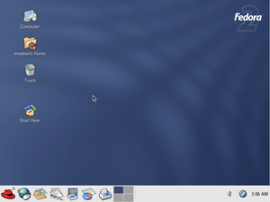
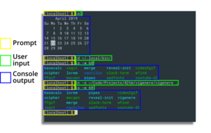
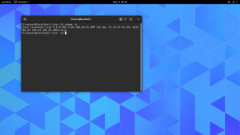
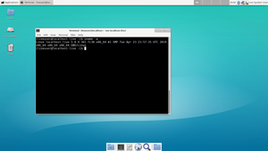
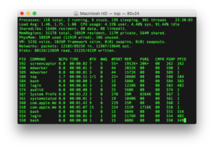

<h1 align="center">Credits</h1>

    This document contains names of people who have contributed to the guide,
    and the licenses used for the guide's contents.

<!-- Link aliases -->
[aut1]: https://github.com/NOVAglow
[cc0]: https://creativecommons.org/publicdomain/zero/1.0/legalcode
[unslic]: https://unsplash.com/license

Text Credits
------------

The following table shows authors and contributors who have made changes to the
text content of the guide, by parts of the guide.

> **Note**: "Author" is the person who created the document and wrote some text
to it. "Contributors" are people who edited the text (excluding the author).

||Author|Contributors|
|:---:|:---:|---|
|**Preamble**|Nguyen Hoang Duong ([@NOVAglow][aut1])||
|**Chapter 1**|Nguyen Hoang Duong ([@NOVAglow][aut1])||
|**Chapter 2**|Nguyen Hoang Duong ([@NOVAglow][aut1])||
|**Chapter 3**|Nguyen Hoang Duong ([@NOVAglow][aut1])||

Image Credits
-------------

This table shows the author, the license, as well as other information of every
image found in `img/`. It is sorted by order of appearance of the images in the
guide, excluding the first 4 images, which are presented in `README.md`.

<!-- This table was generated using script/mkimgcreds.py -->

|Image|Metadata|
|:---:|---|
|  [PNG](img/readme/read-btn.png) &mdash; [SVG](svg/readme/btns.svg)|**Shown in**: `README.md`   **Originality**: Derivative work   **Author**: [Nguyen Hoang Duong](https://github.com/NOVAglow)   **Original authors**: [Nguyen Hoang Duong][aut1], [Icons8](https://icons8.com/), [Lance Anderson](https://unsplash.com/@lanceanderson/portfolio)   **Licenses**: [Creative Commons Zero v1.0 Universal][cc0], [Creative Commons Attribution-NoDerivs 3.0 Unported](https://creativecommons.org/licenses/by-nd/3.0/legalcode), [Unsplash license][unslic]  **Note**: Icon by Icons8, background image by Lance Anderson (cropped).|
|  [PNG](img/readme/glossary-btn.png) &mdash; [SVG](svg/readme/btns.svg)|**Shown in**: `README.md`   **Originality**: Derivative work   **Author**: [Nguyen Hoang Duong](https://github.com/NOVAglow)   **Original authors**: [Nguyen Hoang Duong][aut1], [Icons8](https://icons8.com/), [Lance Anderson](https://unsplash.com/@lanceanderson/portfolio)   **Licenses**: [Creative Commons Zero v1.0 Universal][cc0], [Creative Commons Attribution-NoDerivs 3.0 Unported](https://creativecommons.org/licenses/by-nd/3.0/legalcode), [Unsplash license][unslic]  **Note**: Icon by Icons8, background image by Lance Anderson (cropped).|
|  [PNG](img/readme/credits-btn.png) &mdash; [SVG](svg/readme/btns.svg)|**Shown in**: `README.md`   **Originality**: Derivative work   **Author**: [Nguyen Hoang Duong](https://github.com/NOVAglow)   **Original authors**: [Nguyen Hoang Duong][aut1], [Icons8](https://icons8.com/), [Lance Anderson](https://unsplash.com/@lanceanderson/portfolio)   **Licenses**: [Creative Commons Zero v1.0 Universal][cc0], [Creative Commons Attribution-NoDerivs 3.0 Unported](https://creativecommons.org/licenses/by-nd/3.0/legalcode), [Unsplash license][unslic]  **Note**: Icon by Icons8, background image by Lance Anderson (cropped).|
|  [PNG](img/readme/license-btn.png) &mdash; [SVG](svg/readme/btns.svg)|**Shown in**: `README.md`   **Originality**: Derivative work   **Author**: [Nguyen Hoang Duong](https://github.com/NOVAglow)   **Original authors**: [Nguyen Hoang Duong][aut1], [Icons8](https://icons8.com/), [Lance Anderson](https://unsplash.com/@lanceanderson/portfolio)   **Licenses**: [Creative Commons Zero v1.0 Universal][cc0], [Creative Commons Attribution-NoDerivs 3.0 Unported](https://creativecommons.org/licenses/by-nd/3.0/legalcode), [Unsplash license][unslic]  **Note**: Icon by Icons8, background image by Lance Anderson (cropped).|
|  [PNG](img/prem/bash-example.png)|**Shown in**: Preamble   **Originality**: Original work   **Author**: Rafael S. T. Vieira   **License**: Public Domain  **Note**: Taken from Wikimedia Commons ([link](https://commons.wikimedia.org/wiki/File:Bash_examples.png)).|
|  [PNG](img/ch00/fedo_core_2-screenshot.png)|**Shown in**: Chapter 0   **Originality**: Original work   **Author**: Mewtu (Wikimedia user)   **License**: Public Domain  **Note**: Taken from Wikimedia Commons ([link](https://commons.wikimedia.org/wiki/File:Fedora_Core_2.png)).|
|  [PNG](img/ch00/misleading_button.png) &mdash; [SVG](svg/ch00/misleading_button.svg)|**Title**: Misleading button example   **Shown in**: Chapter 0   **Originality**: Derivative work   **Author**: [Nguyen Hoang Duong](https://github.com/NOVAglow)   **Original authors**: [Nguyen Hoang Duong][aut1], [Google LLC](https://google.github.io/material-design-icons/)   **Licenses**: [Creative Commons Zero v1.0 Universal][cc0], [Apache License 2.0](https://www.apache.org/licenses/LICENSE-2.0.txt)|
|  [PNG](img/ch00/cli_components.png) &mdash; [SVG](svg/ch00/cli_components.svg)|**Title**: 3 Types of Components in a Command Line Session   **Shown in**: Chapter 0   **Originality**: Original work   **Author**: [Nguyen Hoang Duong](https://github.com/NOVAglow)   **License**: [Creative Commons Zero v1.0 Universal][cc0]|
  [GIF](img/ch00/cli_session.gif)|**Shown in**: Chapter 0   **Originality**: Original work   **Author**: [Nguyen Hoang Duong](https://github.com/NOVAglow)   **License**: [Creative Commons Zero v1.0 Universal][cc0]|
|  [PNG](img/ch00/gui_over_cli.png) &mdash; [SVG](svg/ch00/gui_over_cli.svg)|**Title**: GUI over CLI   **Shown in**: Chapter 0   **Originality**: Original work   **Author**: [Nguyen Hoang Duong](https://github.com/NOVAglow)   **License**: [Creative Commons Zero v1.0 Universal][cc0]|
|  [PNG](img/ch00/gnome_terminals.png)|**Shown in**: Chapter 0   **Originality**: Original work   **Author**: [Nguyen Hoang Duong](https://github.com/NOVAglow)   **License**: [Creative Commons Zero v1.0 Universal][cc0]|
|  [PNG](img/ch00/gnome_terminal.png)|**Title**: A GNOME Terminal window   **Shown in**: Chapter 0   **Originality**: Original work   **Author**: [Nguyen Hoang Duong](https://github.com/NOVAglow)   **License**: [Creative Commons Zero v1.0 Universal][cc0]|
|  [PNG](img/ch00/xfce4_terminal.png)|**Title**: An XFCE4 Terminal window   **Shown in**: Chapter 0   **Originality**: Original work   **Author**: [Nguyen Hoang Duong](https://github.com/NOVAglow)   **License**: [Creative Commons Zero v1.0 Universal][cc0]|
|  [PNG](img/ch00/macos_terminal.png)|**Title**: A Terminal window (macOS)   **Shown in**: Chapter 0   **Originality**: Original work   **Author**: [Gortu (Wikipedia user)](https://en.wikipedia.org/wiki/User:Gortu)   **License**: Public Domain  **Note**: Taken from Wikimedia Commons ([link](https://commons.wikimedia.org/wiki/File:Appleterminal2.png)).|
|  [JPG](img/ch01/folders.jpg)|**Shown in**: Chapter 1   **Originality**: Derivative work   **Author**: [Nguyen Hoang Duong](https://github.com/NOVAglow)   **Original author**: [Samuel Zeller](https://unsplash.com/@samuelzeller/portfolio)   **License**: [Unsplash license][unslic]  **Note**: Image cropped by N. H. Duong.|
|  [PNG](img/ch01/fsh.png) &mdash; [SVG](svg/ch01/fsh.svg)|**Title**: Filesystem of Linux operating systems (Visualization)   **Shown in**: Chapter 1   **Originality**: Original work   **Author**: [Nguyen Hoang Duong](https://github.com/NOVAglow)   **License**: [Creative Commons Zero v1.0 Universal][cc0]|
|  [PNG](img/ch01/pushd-vis.png) &mdash; [SVG](svg/ch01/pushd-vis.svg)|**Title**: GNU/Linux's pushd command (Visualization)   **Shown in**: Chapter 1   **Originality**: Original work   **Author**: [Nguyen Hoang Duong](https://github.com/NOVAglow)   **License**: [Creative Commons Zero v1.0 Universal][cc0]|
|  [PNG](img/ch01/popd-vis.png) &mdash; [SVG](svg/ch01/popd-vis.svg)|**Title**: GNU/Linux's popd command (Visualization)   **Shown in**: Chapter 1   **Originality**: Original work   **Author**: [Nguyen Hoang Duong](https://github.com/NOVAglow)   **License**: [Creative Commons Zero v1.0 Universal][cc0]|
|  [PNG](img/ch03/symlink-vis.png) &mdash; [SVG](svg/ch03/symlink-vis.svg)|**Title**: Symbolic link - Visualization   **Shown in**: Chapter 3   **Originality**: Original work   **Author**: [Nguyen Hoang Duong](https://github.com/NOVAglow)   **License**: [Creative Commons Zero v1.0 Universal][cc0]|
|  [PNG](img/ch03/broken_symlink-vis.png) &mdash; [SVG](svg/ch03/broken_symlink-vis.svg)|**Title**: Broken Symbolic link - Visualization   **Shown in**: Chapter 3   **Originality**: Original work   **Author**: [Nguyen Hoang Duong](https://github.com/NOVAglow)   **License**: [Creative Commons Zero v1.0 Universal][cc0]|
|  [PNG](img/ch03/hard_link-vis.png) &mdash; [SVG](svg/ch03/hard_link-vis.svg)|**Title**: Hard link - Visualization   **Shown in**: Chapter 3   **Originality**: Original work   **Author**: [Nguyen Hoang Duong](https://github.com/NOVAglow)   **License**: [Creative Commons Zero v1.0 Universal][cc0]|
