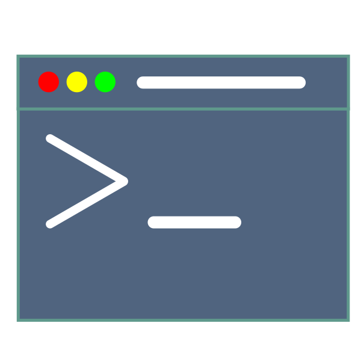
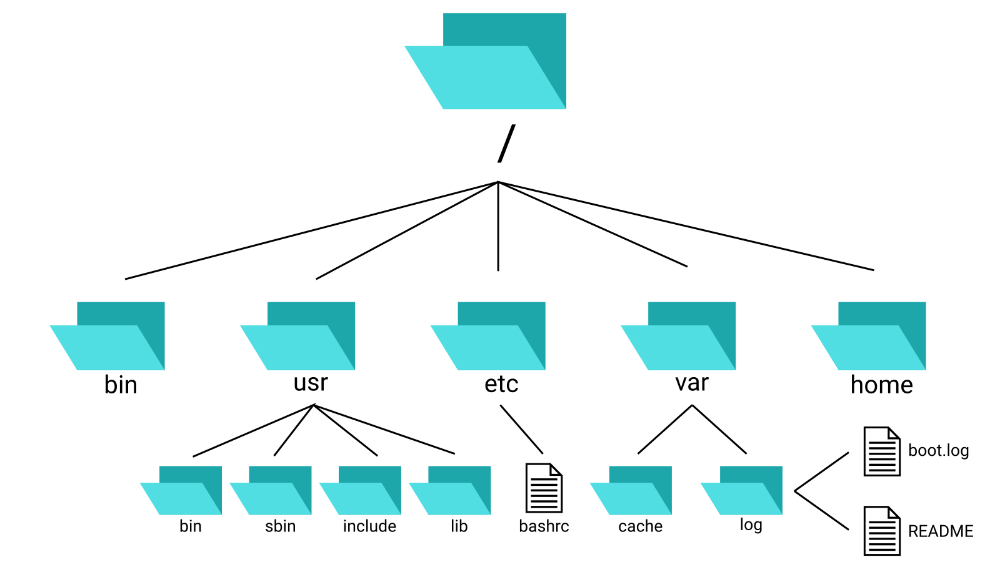

<h1 align="center">42tm's Bash Reference</h1>

<p align="center">
    
</p>

Introduction
------------

This is a GNU/Linux bash guide. The guide will go from the most simple commands
to more advanced ones, hence this guide can be used for learning (i.e. education
purposes). New GNU/Linux users who wish to learn Bash commands can take this
guide. For each command, we will also introduce the helpful options.

At a ground surface, this might just look like another Bash guide on GitHub.
However, you will see the difference as you go along. Let's get started.

Table of Content
----------------

Basic operations with directories
---------------------------------

This section introduces the basic commands that get you moving between different
locations in the file system and viewing the items in a folder or many folders.
If you are relatively new to the GNU/Linux system, you might want to read the
brief description of the Linux file system first, before diving into the
commands.

### Brief description of the Linux file system hierarchy

The files & folders system in GNU/Linux (so-called "Linux") is hierarchical,
like Windows. This means that a folder can contain files, as well as other
folders, and those folders can contain more files and folders. All accessible
files and folders in a GNU/Linux system is stored in a folder, and this folder
is called the root folder, denoted "/". The below graph illustrates a small part
of a file system on a typical GNU/Linux machine, according to the hierarchy.



In a hierarchical file system like this, each file and folder has its own
address (commonly called **paths**). There are 2 types of paths:

1. **Absolute path**: An absolute path goes from the root folder (`/`) and
traces down to the destination folder/file. For example, in the system in the
above illustration, the absolute path of the file `bashrc` is `/etc/bashrc`.
2. **Relative path**: The relative path of a file or folder is the path relative
to a folder. For example, in the system illustrated above, the relative path of
the `boot.log` file relative to the `var` directory is `log/boot.log`. Unlike
absolute paths, relative paths don't begin with `/`.

As you might have noticed, GNU/Linux systems (and Unix systems in general) use
the forward slash character ("/") to separate folders at different hierarchical
level (unlike Windows, which use the backward slash character "\\").

There are three symbols, usually appear in paths, that are reserved for special
purposes:
1. The dot symbol ("."): The dot symbol refers to the current working directory.
2. The double dots symbol (".."): The double dots symbol refers to the parent
directory (i.e. the directory that is one level above in terms of hierarchy).
For example, in the system illustrated above, the relative path of the `README`
file to the `/usr/include` folder has to contain the double dots symbol:
`../../var/log/README`.
3. The tilde symbol ("~"): The tilde symbol refers to the home directory of the
current logged-in user. If you have logged in as a normal user, your home
directory should be `/home/USERNAME`, replacing "USERNAME" with your username
(e.g. if your username is "john", your home directory should be `/home/john/`).
If you have logged in as root (equivalence of admin in Windows), the home
directory should be `/root`.

Just one final note before we proceed: "folder" and "directory" are the same
concepts; the difference is, the term "folder" is used more in graphical
interface, while the term "directory" is used more when talking about the
command line interface. Hence, in this document, you will see the term
"directory" appears more.

### `pwd`

At any time in the command line, you are in a directory, and it's called the
"current working directory". To see the _absolute path_ of that directory, enter
`pwd` (<b>p</b>rint <b>w</b>orking <b>d</b>irectory). Usually, when you just
jumped into the command line, the working directory is the home directory
(either `/root` or `/home/USERNAME`, replacing "USERNAME" with the logged in
user's name).

### Moving between directories using `cd`

`cd` moves you to another folder on the system.

|Example input|Description|
|:--:|---|
|`cd /home/john/Pictures`|Move to directory `/home/john/Pictures` (absolute path).|
|`cd ../Code/Project1`|Move to directory `../Code/Project1` (relative path). Remember that the `..` symbol is used<br>to refer to the parent directory, as discussed in the introduction above.|
|`cd ~`|Move to the home directory. The `~` symbol refers to the home directory.|
|`cd -`|Move to the previous directory that you were in. For example, if you were in `/home/john`,<br>and then you moved to `/home/john/Pictures/Family`, doing `cd -` will move you back<br>to `/home/john`.|
|`cd ..`|Move to the parent directory.|
|`cd .`|Move to the current directory. This is useless, but is still shown up as an example to get you<br>to remember what the dot symbol `.` is for.|

### Moving between directories, advanced: `pushd`, `popd`, and `dirs`

#### The notion of stack and directory stack

Stacks to computer science is like telescopes to astronomy. In computing, you
can think of a stack as a collection of items. There are two basic operations
with stacks, they are **push** and **pop**. The push operation adds an item to
the _end_ of the stack, and the pop operation removes the most recently added
item.

Let's say we have a stack of fruit over here. They are numbered in order from
the least recently added item (number 1) to the most recently added item (number
2).

|     1      |   2    |     3      |  4   |     5     |
|   :---:    | :---:  |   :---:    |:---: |   :---:   |
|:strawberry:|:banana:|:watermelon:|:pear:|:pineapple:|

If we perform a push operation to our fruit stack to add a, say, melon :melon:
to our collection, the stack will become something like this:

|     1      |   2    |     3      |  4   |     5     |   6   |
|   :---:    | :---:  |   :---:    |:---: |   :---:   | :---: |
|:strawberry:|:banana:|:watermelon:|:pear:|:pineapple:|:melon:|

If we perform a single pop operation to the new stack (the one with 6 items
above, not the original one with 5 items), the stack will become something like
this:

|     1      |   2    |     3      |  4   |     5     |
|   :---:    | :---:  |   :---:    |:---: |   :---:   |
|:strawberry:|:banana:|:watermelon:|:pear:|:pineapple:|

Note that after the pop, the most recently added item - the melon :melon: - is
now removed from the stack. Pop one more time:

|     1      |   2    |     3      |  4   |
|   :---:    | :---:  |   :---:    |:---: |
|:strawberry:|:banana:|:watermelon:|:pear:|

Now that you know what a stack is, you might have guessed what a directory
stack is. A directory stack is a stack containing absolute paths that we've
pushed into it. You will see it in action by learning the `pushd`, `popd`, and
`dirs` command below.

#### `pushd`

Just like `cd`, `pushd` moves you to a new directory. However, `pushd` does one
more thing: adding the new directory to the directory stack.

Side notes: `cd .` is useless, but `pushd .` can be useful.

#### `dirs`

`dirs` displays the directory stack.

Let's say you started at your home directory. Then you do
`pushd Pictures/Miscellaneous/`, and then `pushd ~/Videos/`, and then stop at
` pushd ../Templates/`. The output of `dirs` should be like this:

```
~/Templates ~/Videos ~/Pictures/Miscellaneous ~
```

The default display is, however, hard to interpret. If you want `dirs` to print
each path on its own line instead, feed `dirs` the `-p` option. So that is
`dirs -p`. The output should be like this:

```
~/Templates
~/Videos
~/Pictures/Miscellaneous
~
```

You can see that the most recently added element (`~/Templates`) is in the first
line of the output, and the least recently added element
(`~/Pictures/Miscellaneous`) is in the second last line of the output. The last
line of the output is the directory that you were in _before_ you did your first
`pushd` command.

The `~` symbol, as mentioned, refers to the home directory. If you don't want
`dirs` to use this symbol, but use the actual path instead, throw the `-l`
option at it. `dirs -l -p` should be like this (still in the context of our
example, assuming the username is "john"):

```
/home/john/Templates
/home/john/Videos
/home/john/Pictures/Miscellaneous
/home/john
```

To remove all the elements in the directory stack, type `dirs -c`.

Useful options for `dirs`, summarized in a table:

|Option|Description|
|:---:|---|
|-l|Instead of writing the `~` symbol, write the actual path that the symbol refers to.|
|-p|Print each element on its own line.|
|-c|Clear the stack: Remove all the items in the directory stack.|

#### `popd`

`popd` pops the most recently `pushd`ed path, and moves you to the directory
that is now the last element in our directory stack (after the pop operation).

Example: Let's say your directory stack currently looks like this (this is from
a previous example):

```
~/Templates
~/Videos
~/Pictures/Miscellaneous
~
```

...in which `~/Templates` is the most recently added path. If you do a `popd`,
you will be moved to `~/Videos`, and `~/Templates` will be gone from the stack:

```
~/Videos
~/Pictures/Miscellaneous
~
```

`popd` won't do anything (but warns you) if the directory stack is empty.

### Viewing items in a directory: `ls` and `tree`

License
-------


By licensing this work under the [Creative Commons Zero](LICENSE) (CC0) license,
we dedicate it to the public domain. We do this for the benefit of the public at
large.

Credits of images from other sources, along with the license information, are
written under the images, and such images are licensed under a CC0-compatible
license. If an image does not have any credit text under it, that image is our
work and is licensed under CC0.
