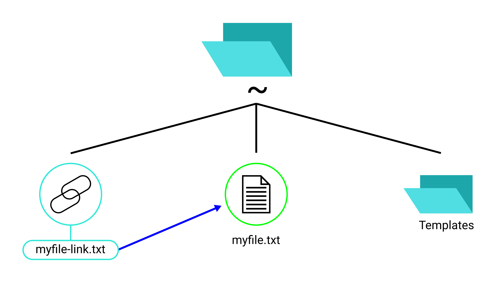
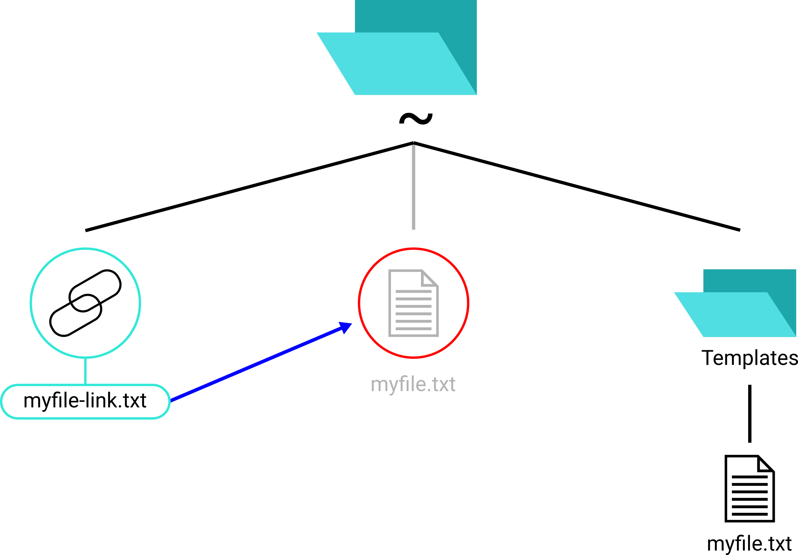

<h3 align="center">Chapter 2</h3>
<h1 align="center">Basic operations with files</h1>

**New commands**: [`cat`](#cat-and-tac), [`tac`](#cat-and-tac), [`less`](#less),
[`head`](#head-and-tail), [`tail`](#head-and-tail), [`stat`](#stat),
[`file`](#file), [`touch`](#using-touch)  
**Commands extended**: [`ls`](#viewing-a-files-timestamp-using-ls)  
**New concepts**: [File handles](#file-handles),
[File timestamps](#notion-of-file-timestamp--types-of-file-timestamps-in-gnulinux)

Table of Content
----------------

1. [Viewing text files](#viewing-text-files)
2. [Input/Output](#inputoutput)
3. [File timestamps](#file-timestamps)
4. [Viewing file's details](#viewing-files-details)
5. [Using `touch`](#using-touch)
6. [Adding and editing file's content](#adding-and-editing-a-files-content)
7. [Deleting a file](#deleting-a-file)
8. [Symbolic links and hard links](#symbolic-links-and-hard-links)

Viewing text files
------------------
###### Tags: `#view`, `#file`, `#text-file`, `#new-command`

### `cat` and `tac`

The `cat` command (con**cat**enate) is usually used to display the content of a
text file to the screen.

Examples:

- `cat myfile`: Print the content of the file `myfile` in the current working
directory to the terminal screen
- `cat /home/john/.bashrc`: Print the content of the file `.bashrc` in
`/home/john` directory

You can also print multiple files out. Example:

```
$ cat file1 file2 file3
This is content inside file1.
This is content inside file2.
This is content inside file3.
```

The `tac` command is similar to `cat`, but it prints the file in the reversed
order (last line in the file is printed first, then go up until the first line).

### `less`

The problem with `cat` is, it prints the content of the file and then return you
to the command prompt. Which means if you `cat` a long text file, the content of
the file will not be fully displayed inside your screen, and you will have to
use shortcuts like `Shift` + `Fn` + `Up arrow key` and `Shift` + `Fn` + `Down
arrow key` to scroll. But things got worse. If the text file is thousands of
lines long, the first lines will be gone.

To solve this problem, you need a program that provides you an interface to view
text file with up and down arrow keys for scrolling. And that program is `less`.
Doing `less large_file.txt` allows you to view the file `large_file.txt`, and
you can use the up and down arrow keys for scrolling. To return to the command
prompt, hit the Q key.

### `head` and `tail`

`head` prints the first few lines of a text file only. By default, it prints
the first 10 lines. You can customize the number using the `-n` option.

Examples:
- `head script.sh`: Print the first 10 lines in the file `script.sh`
- `head -n 25 script.sh`: Print the first 25 lines in the file `script.sh`
- `head -25 script.sh`: Shorthand for `head -n 25 script.sh`

In contrast, the `tail` command prints the last few lines in a text file. Other
than that, `tail` is the same as `head` at the basic level:

- Just like `head`, `tail` prints out 10 lines by default
- `tail` also has the `-n` option which lets the user changes the number of
lines printed to the console
- `tail` also has a shorthand for `-n`

Just like `cat`, `head` and `tail` can take multiple files as input. However,
when taking multiple files as input, `head` and `tail` do explicitly write the
name of each of the file before printing the first lines of that file. This
behavior isn't presented in `cat`. See example below. The command is
`head -5 COPYING COPYING.LESSER`.

```
==> COPYING <==
                    GNU GENERAL PUBLIC LICENSE
                       Version 3, 29 June 2007

 Copyright (C) 2007 Free Software Foundation, Inc. <https://fsf.org/>
 Everyone is permitted to copy and distribute verbatim copies

==> COPYING.LESSER <==
                   GNU LESSER GENERAL PUBLIC LICENSE
                       Version 3, 29 June 2007

 Copyright (C) 2007 Free Software Foundation, Inc. <http://fsf.org/>
 Everyone is permitted to copy and distribute verbatim copies
```

Input/Output
------------
###### Tags: `#new-concept`, `#file`, `#io`

### File handles
###### Tags: `#new-concept`, `#file`, `#io`

When a program (e.g. a Bash command) is ran, three file handles can be used
by the program. They are **stdin** (<b>st</b>an<b>d</b>ard <b>in</b>put),
**stdout** (<b>st</b>an<b>d</b>ard <b>out</b>put), and **stderr**
(<b>st</b>an<b>d</b>ard <b>err</b>or).

| Handle's name |Handle's symbolic name|                       Description                       |      Example      |
|     :---:     |        :---:         |                           ---                           |        ---        |
|Standard input |        stdin         |Where the program reads to get information from the user.|Keyboard           |
|Standard output|        stdout        |Where the program writes output to.                      |The terminal screen|
|Standard error |        stderr        |Where the program writes error information to.           |Log file           |

### I/O Redirection
###### Tags: `#file`, `#io`

Now that we've learned about file handles, let's talk about I/O redirection
("I/O" is short for "Input/Output"). I/O redirection refers to the redirection
of the three file handles so that we can get the input from somewhere else
and/or print the output to somewhere else.

Take the `cat` command that we talked about earlier, for example. If you tried
running `cat`, you know that `cat` writes the content of a file (or many files)
to the terminal screen. But what if you want it to write to a file instead? This
can simply done by I/O redirection. In particular, you use the greater than sign
(">") after the `cat` command, followed by the name of the file that you want
`cat` to write its output to. Here's an example:

```
cat file1 file2 file3 > myfile
```

In the above example, instead of writing the contents of the files `file1`,
`file2` and `file3` to the terminal screen, `cat` writes to `myfile` instead.
`myfile` should now contain the content of `file1`, `file2` and `file3`
concatenated together.

We just redirected the stdout. What about stdin? You can feed a command with
input from a file, by using the less than sign ("<"). Here's an example:

```
cat < myfile
```

Again, we use `cat` as example, because `cat` can take stdin from a file. In the
above example, `cat` takes `myfile` to consume for input data. It should print
out the content of `myfile` (which is the same as doing `cat myfile`).

What about stderr? Usually, stderr is written to the terminal screen and a log
file, but you can also redirect stderr. Redirecting `stderr` is the same as
redirecting `stdout`, but the only difference is, you type "2>" instead of ">".

```
rm myfile 2> error_file.txt
```

In the above example, `rm myfile2` is executed and any error message produced
by the `rm` command should not be written out to the terminal screen but to the
text file `error_file.txt` instead.

Finally, if you want to redirect both stdout and stderr to a text file, use the
">&" symbol.

```
tree . >& output.txt
```

In the example above, all normal output and error information coming from `tree`
should be written to the text file `output.txt` instead of the terminal screen.

File timestamps
---------------
###### Tags: `#file`, `#new-concept`, `#extend`, `#timestamp`

### Notion of file timestamp & Types of file timestamps in GNU/Linux
###### Tags: `#file`, `#new-concept`, `#timestamp`

A file's timestamp is the time when something happened to the file (e.g. when
the file's content was last changed). In GNU/Linux (as well as other Unix &
Unix-like operating systems), each file has 3 timestamps: access time,
modification time, and change time. The following table gives you more
information about these timestamps:

|    Timestamp    |Abbreviation|                                         Description                                         |
|      :--:       |    :--:    |                                             ---                                             |
|   Access time   |   atime    |The time when the file was last read (e.g. by a program like `cat`).                         |
|Modification time|   mtime    |The time when the file's content was last changed.                                           |
|   Change time   |   ctime    |The time when anything of the file was last changed (e.g. content, permission, owner, etc.). |

Knowing about file timestamps is very useful, especially when you are a Linux
system administrator. For example, you might want to delete files that haven't
been accessed (read) for more than 90 days. We'll learn how to do that later,
but first, you need to know how to view the timestamps, and that is shown in
this section below.

### Viewing a file's timestamp using `ls`
###### Tags: `#file`, `#extend`, `#timestamp`, `#view`

The `ls` lists files in a directory by specifying the path of the directory to
it, but you can also specify file names to it. For example:

```
$ ls myfile1.txt
myfile1.txt
$ ls myfile1.txt myfile2.txt myfile3.txt
myfile1.txt myfile2.txt myfile3.txt
```

Specifying files' paths without an option to `ls` seems useless, so we'll use
the `-l` option instead. The `-l` option tells `ls` to list files in long
format that includes some information associating with the each of the file,
including the modification time (mtime), as [previously mentioned](chapter01.md#ls)
(see that section again if you want to refresh your memory on these). Example
output of `ls -l report.txt`:

```
-rwxrwxr-x. 1 john john 7170 May 20 13:45 report.txt
```

In the above example output, the mtime is written ("May 20 13:45"), indicating
that the file `report.txt` was last modified on 20 of May at 13:45. With
additional option, you can get `ls` to print out the atime or ctime instead of
the mtime. The options for those are `-u` and `-c`, respectively.

```
$ ls -l -u README.md
-rwxrwxr-x. 1 jane jane 7170 Jul 25 14:30 README.md
```

The above example output shows that the last time the file `README.md` was read
(the atime) is 25 of July, at 14:30.

```
$ ls -l -c punchcard
-rwxrwxr-x. 1 you_create you_create 7170 May 20 13:45 punchcard
```

The above example output shows that the last time the file `punchcard` was
changed (the ctime) is 20 of May, at 13:45.

Viewing file's details
----------------------
###### Tags: `#view`, `#file`, `#new-command`

### `stat`

`stat` (<b>stat</b>us) is a command line utility that is used to print various
information of a file. Simply give it a file's path or directory's path. Below
is an example.

```
$ stat git-punchcard
File: git-punchcard
Size: 7170      	Blocks: 24         IO Block: 4096   regular file
Device: fd02h/64770d	Inode: 7215076     Links: 1
Access: (0775/-rwxrwxr-x)  Uid: ( 1000/john)   Gid: ( 1001/john)
Context: unconfined_u:object_r:user_home_t:s0
Access: 2018-07-30 22:33:35.718549094 +0700
Modify: 2018-05-20 13:44:09.077679229 +0700
Change: 2018-05-20 13:44:16.043662333 +0700
Birth: -
```

In the example above, the input command `stat git-punchcard` and its output are
shown. Several information about the file can be gathered from the output:
- The file's size is 7170 bytes (or 7.1 kilobytes).
- It is a regular file (can also be "directory" or "symbolic link").
- Its inode number is 7215076 (a file's inode number is like its index number
within the file system).
- Its access permission ("`Access: (0775/-rwxrwxr-x`"), we'll cover this later,
but this is a pretty important information, so keep in mind).
- The user who owns this file is "john" ("`Uid: ( 1000/john)`") and the group
that owns the file is "john" ("`Gid: ( 1001/john)`"). Again, we'll learn about
users and groups later.
- It's access time (atime), modification time (mtime), and change time (ctime).

As mentioned, you can also give `stat` a directory's path.

### `file`

Unlike `stat`, `file` is an utility that focuses on displaying information that
is specific to a certain file type.

Most files have an extension each. For example, the file `report.txt`'s
extension is "txt", which indicates that it is a text file. That is not the case
100% of the time, however. For instance, you can change the `report.txt` file's
extension to "pdf", which is a PDF file's extension. Now we end up with
`report.pdf`, but `report.pdf` is still a text file: Changing a file's extension
in its name doesn't change the file's actual type. Hence you cannot rely on the
file's extension to determine a file's type. The Windows operating system relies
on the file's extension to determine the file type and the default application
to open files with that type, but that's not a good approach.

This is where the `file` command comes into play. The `file` command determines
a file's type by analyzing that file's content instead of the file's extension.
After knowing the file's actual type, `file` might also display more information
that is specific to that file's type. Let's look at some examples.

```
$ file git-punchcard
git-punchcard: Python script, ASCII text executable
```

In the above example, it appears that the file `git-punchcard` is an ASCII text
file. Furthermore, it's a Python script (code and script are text, basically).
`file` also tells us that `git-punchcard` is executable.

```
$ file image.png
image.png: PNG image data, 1100 x 400, 8-bit/color RGB, non-interlaced
```

In the above example, the file `image.png` appears to be a PNG image that is
1100 pixels in width and 400 pixels in height. The image uses 8-bit RGB color
profile.

```
$ file venture.mp3
venture.mp3: Audio file with ID3 version 2.3.0, contains:MPEG ADTS, layer III, v1, 320 kbps, 44.1 kHz, JntStereo
```

In the above example, we can interpret that the file `venture.mp3` is an audio
file using ID3 metadata scheme version 2.3.0 with a bit-rate of 320kbps.

Using `touch`
-------------
###### Tags: `#new`, `#timestamp`, `#file`, `#new-command`

`touch` has two functions: Creating new file and updating a file's timestamp

### Creating a new file
###### Tags: `#new`, `#file`

Simply throw a name as an argument to `touch`:

```
$ touch newfile
```

That's it. In the example above, an empty file called `newfile` will be created.
You can also create multiple new empty files.

```
$ touch newfile1 newfile2 newfile3
```

### Changing a file's timestamps
###### Tags: `#file`, `#timestamp`

If you give `touch` a file that is already presented on the system, however,
`touch` will set the file's timestamps (all of the timestamps) to the current
time (meaning the time when you ran the `touch` command). Let's have an example.
Here we have a file called `image.png`:

```
$ stat image.png
  File: image.png
  Size: 21292     	Blocks: 48         IO Block: 4096   regular file
Device: fd02h/64770d	Inode: 7215568     Links: 1
Access: (0664/-rw-rw-r--)  Uid: ( 1000/you_create)   Gid: ( 1001/you_create)
Context: unconfined_u:object_r:user_home_t:s0
Access: 2018-07-31 12:30:52.089412120 +0700
Modify: 2018-07-28 11:19:05.686188118 +0700
Change: 2018-07-28 11:19:05.686188118 +0700
 Birth: -
```

As you can see, the file's timestamps vary. Now if we do `touch image.png`...

```
$ touch image.png
$ stat image.png
  File: image.png
  Size: 21292     	Blocks: 48         IO Block: 4096   regular file
Device: fd02h/64770d	Inode: 7215568     Links: 1
Access: (0664/-rw-rw-r--)  Uid: ( 1000/you_create)   Gid: ( 1001/you_create)
Context: unconfined_u:object_r:user_home_t:s0
Access: 2018-07-31 20:45:30.299611928 +0700
Modify: 2018-07-31 20:45:30.299611928 +0700
Change: 2018-07-31 20:45:30.299611928 +0700
 Birth: -
```

...all three timestamps are updated to the current time.

You might be wondering, "what's the point of updating a file's timestamps?".
One example of real usage of that is this: A lot of GNU/Linux users (mostly
those that are system administrators) have scripts to clean old files that are
ran between intervals. For example, one might want to delete old log files that
haven't been accessed for at least 10 months. If one of those log files still
needs to be kept, however, one can use `touch` to update that file's
timestamps so that the automated file deleting task won't delete that particular
log file.

If you don't want `touch` to update all of the file timestamps but a particular
timestamp only, there are `touch`'s options for that. Below is a table of useful
`touch` options. The option(s) must be specified before the file name(s).

|Option|          Hint          |                                 Description                                 |
|:---: |         :---:          |                                     ---                                     |
| `-a` |   <b>a</b>ccess time   |Change the access time (atime) only.                                         |
| `-m` |<b>m</b>odification time|Change the modification time (mtime) only.                                   |
| `-r` |    <b>r</b>eference    |Make a file's atime and mtime the same as a reference file's atime and mtime.|
| `-t` |      <b>t</b>ime       |Manually specify time instead of using the current time.                     |

For `-r` option, you must also specify a reference file as an argument. This
option updates the targeted file's atime and mtime to match the reference file's
atime and mtime. The ctime is updated to the current time as usual. For instace,
running the command below will match `crash-report.txt`'s atime and mtime to
`reffile`'s atime and mtime, respectively.

```
$ touch -r var/reffile crash-report.txt
```

For `-t` option, you must specify a particular time as an argument. This time is
in the format CCYYMMDDhhmm.ss, in which:
- CC is for first two digits of a year, YY is for the last two digits of a year,
M is for month, D is for day of the month, h is for hour, m is for minute, s is
for second
- CC, YY, and .ss are optional parts, but if you do specify the CC part, you
must also specify the YY part

Example arguments for the `-t` option:

|   Argument   |                   Meaning                   |
|    :---:     |                     ---                     |
|   08202200   |20 of August this year, at 22:00 (10PM)      |
| 201612300830 |30 of December, 2016, at 8:30 (8:30 AM)      |
|1701121620.50 |12 of January, 2017, at 16:20:50 (4:20:50 PM)|

> **Note**: You can also use `touch` to change a directory's timestamps :+1:.

Adding and editing a file's content
-----------------------------------
###### Tags: `#file`, `#editing`, `#io`, `#extend`, `#text-file`

### Adding content to a text file
###### Tags: `#file`, `#text-file`, `#io`, `#extend`

There are 2 simple commands that we've covered that can be used to add text
content to a text file: `echo` and `cat`, plus the use of I/O redirection.

> **Note**: See the section on [I/O redirection](#io-redirection) again if you
need to refresh your memory on this topic.

In addition to the greater than sign (">") and the less than sign ("<") that
we've learned in the section about I/O redirection, there is also the double
greater than sign (">>"). The double greater than sign is used to append
standard output. For instance, if you have a non-empty file `demo.txt`, doing
`echo "This is some text" > demo.txt` will overwrite `demo.txt`'s existing
content, meaning `demo.txt` will only have the line "This is some text". But if
you use the double greater than sign operator ("`echo "This is some text" >>
demo.txt`"), the line "This is some text" will be added at the end of the file,
and the file's existing content will still be there.

As for `cat`, this command will write whatever you've entered in to stdout if
you give it no argument. You can try that out, just type `cat`, that's it, and
hit Enter.

```
$ cat
Line 1
Line 1
Line 2
Line 2
Line 3
Line 3
```

You can quit by hitting Ctrl + D (or Ctrl + C). The main point here is, we can
actually use this feature, redirect the stdout to a file, thus populating that
file with text. The file does not necessary have to be presented before you do
this.

```
$ cat > somefile
Line 1  
Line 2
Line 3
$ cat somefile
Line 1
Line 2
Line 3
```

### Editing a text file's content
###### Tags: `#file`, `#text-file`, `#editing`, `#new-command`, `#new-program`

As for editing a text file, you can use a text editor. There are text editors
that are made to operate in the command line environment, but there are, of
course, graphical text editors. There should be at least one graphical text
editor that comes pre-installed on your system (ummm...assuming you've installed
a GNU/Linux distribution that comes with a graphical interface and not something
like Arch Linux). If you are using the GNOME desktop environment, there should
be GEdit. If you are using KDE desktop environment, there can be KWrite, KEdit,
or Kate. Graphical editors should be easy for you to use, if you've had some
experience with computers before.

> **Note**: A desktop environment is a little bit out of scope to explain in
details in this tutorial, but basically it provides your computer a graphical
interface, usually along with graphical programs that share the same look.

> **Note**: You can invoke a graphical text editor from your terminal emulator
window. For example, to start GEdit - the default text editor in GNOME, type
"`gedit`". Of course, this assumes that you are in a graphical environment.

- **Graphical text editors**: GEdit, KEdit, Atom, Geany, GVim, ...
- **CLI text editors**: Nano, Vim, Emacs, ...

Deleting a file
---------------
###### Tags: `#file`, `#extend`, `#remove`

[As mentioned in chapter 1](#removing-a-directory), the `rm` command can be used
to delete files. Simply give `rm` the name(s) of the file(s) you want to delete.

This command removes `file1`:
```
rm file1
```

This command removes `file1`, `file2`, `file3`:
```
rm file1 file2 file3
```

Note that the `-r` option, which is necessary to remove directories, isn't
necessary when you delete files only. But there's no harm doing it.

This command removes `file1` and `file2`, which are 2 example files used here,
and `dir1` and `dir2`, which are directories.
```
rm -r file1 file2 dir1 dir2
```

`rm` has several other useful options, which are `-i` and `-I`. If you use `-i`,
`rm` will prompt you before every removal. Enter "y" to remove, "n" to keep.

```
$ rm -r -i file1 file2 file3 dir1 dir2
rm: remove regular empty file 'file1'? y
rm: remove regular empty file 'file2'? y
rm: remove regular empty file 'file3'? n
rm: remove directory 'dir1'? y
rm: descend into directory 'dir2'? y
rm: remove regular empty file 'dir2/file2'? n
rm: remove regular empty file 'dir2/file1'? y
rm: remove directory 'dir2'? n
```

In the example above:
- The files `./file1`, `./file2` are deleted.
- Empty directory `./dir1` is deleted.
- File `./file3` is **not** removed.
- Directory `./dir2` is _not_ empty, so `rm` has to prompt the user before
deleting _every_ file and _every_ folder before removing. If a directory inside
`./dir2` is also not empty, `rm` will do the same as it does with `./dir2`.
- `./dir2/file1` is removed, `./dir2/file2` is **not**.
- `./dir2` is **not** removed. Even if the user typed "y", it still wouldn't be
removed, because if it is removed, `./dir2/file2` must also be removed, but
earlier the user confirmed that `./dir2/file2` shall not be removed.

> **Note**: In case you are wondering what the "./" thing shown above is: The
dot symbol (".") refers to the current working directory, and the "/" is the
directory delimiter as usual. So `./file1` is `file1` in the current working
directory. The dot symbol was first mentioned and explained in
[early chapter 1][edc1].

[edc1]: chapter01.md#brief-description-of-the-linux-file-system-hierarchy

> **Note**: The Bash input used to generate the example files and folders in
the above example is `mkdir dir1 dir2; touch file1 file2 file3 dir2/file1
dir2/file2`.

The `-I` option makes `rm` prompts if you are trying to remove more than 3
files, or removing recursively (with the `-r` option). `rm` with `-I` prompts
_only once_.

```
$ rm -I report.txt git-c.txt log-0245.txt log-0362.txt
rm: remove 4 arguments? y
```

`-i` and `-I` are options that make you think twice before removing files or
directories, avoiding mistakes. Note that **`rm` deletes stuff permanently**
(i.e. it does not move the specified files/folders into Trash or Recycle Bin or
anything like that).

This table summarizes `rm`'s useful options:

|Option|Hint|Description|
|:---:|:---:|---|
|`-r` (or `--recursive`)|<b>r</b>ecursively|Remove directories recursively. Must be invoked when removing a non-empty directory.|
|`-i`||Prompt before _every_ removal.|
|`-I`||Prompt once before removing recursively or removing more than 3 files.|
|`-f` (or `--force`)|<b>f</b>orce|If a specified file or directory does not exist, ignore and move on. Also, never prompt the user to confirm.|

Symbolic links and hard links
-----------------------------
###### Tags: `#new-concept`, `#new-command`

Suppose you want to have 2 files that have the same exact content. What would
you do? Copy and paste? Ummm...no. There are two downsides to copying:
1. Your hard disk drive is consumed more. This is especially true for large
files. If a file is 50MB in size, its copy will also be 50MB, and now both the
original file and the copy take up 100MB.
2. If the original file's content is changed, you have to update the copy.

This is where links come into play. Symbolic links and hard links are some of
the most useful things in GNU/Linux.

### Symbolic link

A symbolic link (also called "symlink") is a pointer to another file. It refers
to the target file by a relative path between it and the target file. Whenever
you access a symbolic link, you are actually accessing the file that the link
refers to.

It's best to see what this means by doing an example. To create a symbolic link,
we use the `ln` command:

```
ln -s target-file-path link-name
```

...replacing "`target-file-path`" with path to the file that you want to create
a link of, and "`link-name`" with name of the link. The `ln` command, here,
should be used with the `-s` option (otherwise it will create a hard link,
which we'll go over next).

Do the following:
1. Create a text file called "`myfile.txt`" in your home directory.
2. Add some text content to `myfile.txt`.
3. Run `ln -s myfile.txt myfile-link.txt`. This will create a symbolic link of
`myfile.txt` called `myfile-link.txt`.
4. Run `cat myfile-link.txt`. `myfile.txt`'s content should be displayed.
5. Change `myfile.txt`'s content.
6. Run `cat myfile-link.txt` again. Is `myfile.txt`'s updated content displayed?

```
$ touch myfile.txt                     # Step 1
$ cat > myfile.txt                     # Step 2
Hello, World!
$ ln -s myfile.txt myfile-link.txt     # Step 3
$ cat myfile-link.txt                  # Step 4
Hello, World!
$ echo "Hello, student!" > myfile.txt  # Step 5: Changing myfile.txt's content
$ cat myfile-link.txt                  # Step 6
Hello, student!
```



7. Run `stat myfile.txt` and `stat myfile-link.txt` and see the sizes (labeled
"`Size`"). Are the sizes different?

```
$ stat myfile.txt
  File: myfile.txt
  Size: 16        	Blocks: 8          IO Block: 4096   regular file
  ...
$ stat myfile-link.txt
  File: myfile-link.txt -> myfile.txt
  Size: 10        	Blocks: 0          IO Block: 4096   symbolic link
  ...
```

As you can see above, `myfile.txt`'s size is 16KB, while the link's size is
10KB. Even if `myfile.txt`'s content was larger, the link's size would still be
10KB. This is what makes symbolic links useful.

> **Note**: A large part of each of the `stat` command's output was replaced
with "...".

> **Note**: Remember that the link contains the _relative_ path between the link
and the file that the link refers to. In this case, the link (`myfile-link.txt`)
contains the path "myfile.txt". Each character is 1KB in size, the string
"myfile.txt" has 10 characters, thus the link is 10KB in size. If the relative
path was something different (i.e. longer or shorter), the link's size would be
different. Thus, not all symbolic links are 10KB in size.

8. Move `myfile.txt` to somewhere else (e.g. to `~/Templates`). Run
`cat myfile-link.txt`. What happens?

```
$ mv myfile.txt Templates/  # Moving myfile.txt from its original location
$ cat myfile-link.txt
cat: myfile-link.txt: No such file or directory
```

A symbolic link refers to a file via a relative path between the link and the
actual file. When you move `myfile.txt` to another location, the relative path
that `myfile-link.txt` has is not updated, thus the link is now referring to a
non-existent file.



9. Now that you've completed this task, delete `myfile-link.txt` and
`myfile.txt`.

### Hard link

A hard link is a file that has the same inode number as another file. Files that
have the same inode number have the same content. When the content of one of
those files is changed, the contents of other files are changed, too.

To create a hard link, use `ln` without the `-s` option:

```
ln any-file-path link-name
```

The below Shell session demonstrates hard links.

```
$ cat > myfile.txt         # Create a new text file & add some content to it
A demonstration of links.
$ ln myfile.txt hlink.txt  # Create a hard link named "hlink.txt"
$ cat hlink.txt            # hlink.txt shares the same content with myfile.txt
A demonstration of links.
$ echo "A demonstration of hard links." > myfile.txt
$ cat hlink.txt
A demonstration of hard links.
$ echo "Second line to file." >> hlink.txt
$ cat myfile.txt
A demonstration of hard links.
Second line to file.
$ cat hlink.txt
A demonstration of hard links.
Second line to file.
$ mv hlink.txt Templates/  # Moving hlink.txt to somewhere else
$ cat myfile.txt
A demonstration of hard links.
Second line to file.
$ cat Templates/hlink.txt  # Location doesn't matter
A demonstration of hard links.
Second line to file.
```

To see the inode number of a file, use `ls -i`:

```
$ ls -i myfile.txt Templates/hlink.txt
16517901 myfile.txt  16517901 Templates/hlink.txt
```

In the example output above, both `myfile.txt` and `Templates/hlink.txt` have
16517901 as the inode number.
